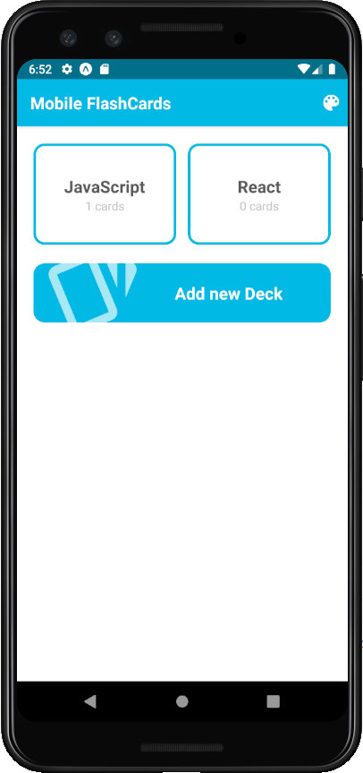

This project was made to [React Nanodegree](https://www.udacity.com/course/react-nanodegree--nd019).

*"For the Flashcards Mobile project, you'll build a mobile app (Android or iOS - or both) that allows users to study a collection of flashcards. With the app, users can create different categories of flashcards called "decks", add flashcards to those decks, and make the quizes in these decks."*

## Cloning the repository
On terminal, go to the desired folder to clone this repository.
### `git clone https://github.com/vinicius98s/udacity-my-reads.git`

## Installing dependencies
You can install all project's dependencies with:
### `npm install` or `yarn install`

## Running our application
You must have the expo cli installed on your machine to run the project
### `yarn global add expo-cli` or `npm install -g expo-cli`

Then you can run with the command:
### `expo start`

You have 2 options to run the app, you can download the expo application on the app store or the play store and you will notice you have the application shown on your homescreen, as soon as you are on the same network you run the project. The second option is to run along a emulator (on the GUI opened on your browser you will see these options).

### Application Home View

